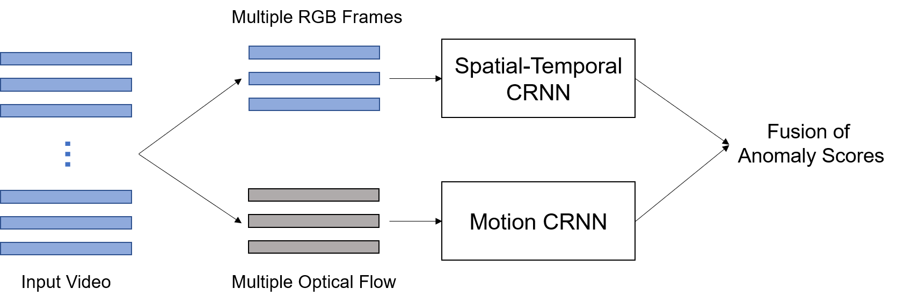
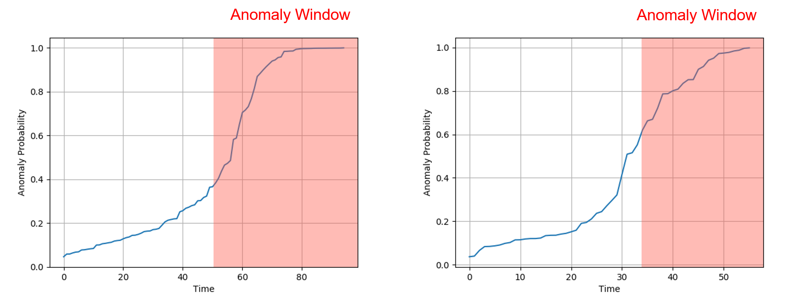

# Traffic Accident Detection via Deep Learning

This repository contains the code of our IDL course project in Fall 2020.

NOTE: this repo is only for the course project and will not be maintained after this semester.

## Contributors

**Yifan Peng** (@pyf98) and **Amine Bellamkaddem** (@amine-bellamkaddem) are the two contributors of this repository.

**Yifan Peng** is the main contributor of this project. He implemented the vast majority of our models. Specifically, he provided an initial version for `frame_video_level_cnn`, which was further developed by Amine. All the other scripts in this repository are completed by Yifan Peng.

**Amine Bellamkaddem** developed `frame_video_level_cnn` based on the initial version by Yifan and explored more architectures such as VGG16. He also provided the current visualization plots. Please see the folder `frame_video_level_cnn` for more information.

Details about division of work is in our final report.

## Introduction

Detecting anomalous events such as road accidents in natural driving scenes is a challenging task. The majority of previous studies focus on fixed cameras with static backgrounds. In this project, we design **a CRNN-based two-stream method using both RGB frames and optical flow to detect traffic accidents in first-person dash-cam videos**. Our hypotheses are that motion features can improve the detection performance and that CRNN-based approaches are better for modeling temporal relationship than conventional CNN-based approaches. Results show that the motion stream outperforms the spatial-temporal stream, and that the fusion of two streams can further improve our model's performance.



## Requirements

Our models are implemented using PyTorch. Required packages are listed in `requirements.txt`.

```
numpy
tqdm
torchvision==0.7.0
torch==1.6.0
Pillow
scikit_learn
```

To install these packages, run

```
pip install -r requirements.txt
```

All models can be trained on a single NVIDIA Tesla T4 GPU using the default configuration.

## Dataset

We employ a recently introduced traffic anomaly dataset called [Detection of Traffic Anomaly](https://github.com/MoonBlvd/Detection-of-Traffic-Anomaly "Detection of Traffic Anomaly Dataset") (DoTA). DoTA contains 4,677 dash-cam videos collected from YouTube channels. These ego-centric driving videos are from different countries and under different weather and lighting conditions.

**Note that due to issues with YouTube, some videos are no longer available. We have collected 4,085 videos in total.** Most videos in DoTA can be separated into three temporal partitions: precursor, anomaly window, and post-anomaly. We label the first part (i.e. precursor) as *normal* or *non-accident*, and the second part (i.e. anomaly window) as *anomaly* or *accident*, but we do not use the third part. Details of our dataset are shown below.

Dataset | Training | Validation | Test
:---: | :---: | :---: | :---:
\#video clips | 5,700 | 801 | 1,657
\#frames | 208,649 | 29,997 | 58,778

Dataset classes are defined in `data.py`.

## Models

Models are defined in `networks.py`.

### Spatial-Temporal Stream

The spatial-temporal stream takes RGB frames as input, which contain appearance information. To extract frame-level features from an input video, an ImageNet pre-trained ResNet is applied. To capture high-level (temporal) information, three architectures are employed: a multi-layer perceptron (MLP), a unidirectional Long Short-Term Memory (LSTM), and a bidirectional LSTM (BiLSTM). The MLP doesn't consider temporal dependencies, which leads to degraded performance.

* ResNet + MLP: The code is in `frame_video_level_cnn`. Models are trained on individual frames and evaluated by frame-level and video-level metrics.

* ResNet + LSTM: The network configuration is in `conf/lstm_rgb.py`. Note that `configs['net']['rnn_bidir']` should be set to `False` for unidirectional LSTM. To train a model, run `python train_lstm_rgb.py`. To evaluate a trained model, run `python test_lstm_rgb.py --ckpt path/to/checkpoint`. Please refer to `test_lstm_rgb.py` for other options such as `n_frames` and `batch_size`.

* ResNet + BiLSTM: Similar to the second model, the network configuration is in `conf/lstm_rgb.py`. Note that `configs['net']['rnn_bidir']` should be set to `True` for bidirectional LSTM. To train a model, run `python train_lstm_rgb.py`. To evaluate a trained model, run `python test_lstm_rgb.py --ckpt path/to/checkpoint`. Please refer to `test_lstm_rgb.py` for other options such as `n_frames` and `batch_size`.

After running the test script, predictions will be saved as a `.npy` file in the same folder as the model checkpoint. The saved file can be used in the fusion section.

")


### Motion Stream

The motion stream takes dense optical flow as input, which represents motion features. Our results have demonstrated that motion features are better for accident detection in dash-cam videos with dynamic backgrounds. We utilize a recently proposed deep learning-based algorithm ([RAFT](https://github.com/princeton-vl/RAFT)) to estimate optical flow and save optical flow maps as jpg images. Note that each optical flow map has only two channels (horizontal and vertical) instead of three, so the last color channel of the image is set to zero.

Here we compare three architectures: ResNet-based Conv2d, ResNet with LSTM, and ResNet with BiLSTM. Results show that LSTMs have better capacity for modeling temporal relationship within a video clip, which achieve higher AUC and accuracy.

* ResNet-based Conv2d: Different from CNN-MLP for 3-channel RGB frames, each time this model takes stacked optical flow maps as input, which can be considered as a multi-channel image. The ResNet is initialized with pre-trained weights but the first convolutional layer needs additional processing (3-channel -> multi-channel). The configuration file is `conf/cnn_flow.py` which contains all the hyperparameters for training. To train a model from scratch, run `python train_cnn_flow.py`. To resume training, first set the `configs['resume']` variable in `conf/cnn_flow.py` and then run `python train_cnn_flow.py`. To evaluate a trained model, run `python test_cnn_flow.py --ckpt path/to/checkpoint`. Other options such as `data_root`, `data_list` and `batch_size` can also be changed.

* ResNet + LSTM: The network configuration is in `conf/lstm_flow.py`. For unidirectional LSTM, set `configs['net']['rnn_bidir'] = False`. To train a model, run `python train_lstm_flow.py`. To evaluate a trained model using the test set, run `python test_lstm_flow.py --ckpt path/to/checkpoint`.

* ResNet + BiLSTM: The network configuration is in `conf/lstm_flow.py`. For bidirectional LSTM, set `configs['net']['rnn_bidir'] = True`. To train a model, run `python train_lstm_flow.py`. To evaluate a trained model using the test set, run `python test_lstm_flow.py --ckpt path/to/checkpoint`.

After running the test script, results will be saved as a `.npy` file, which can be used in the fusion section.


### Fusion of Two Streams

There are many fusion strategies that can be used to merge two predictions. We adopt a simple but effective strategy, namely weighted average fusion after the last activation. The main advantage of this approach is that we don't need to retrain our model and there is only one hyperparameter, i.e. the weight of the first prediction.

```
fusion_pred = rgb_weight * rgb_pred + (1. - rgb_weight) * flow_pred
```

To calculate the fusion of two streams, run this command:

```
python test_combined.py --rgb_file path/to/rgb/results --flow_file path/to/optical/flow/results --rgb_weight your_preferred_weight
```

It will automatically calculate the video-level AUC and accuracy, which will be display in the terminal.

## Results

Our evaluation metric is video-level AUC and accuracy (ACC). Please refer to our final report for the details.

The following figure visualizes our result. The red region represents the anomaly window. Our model is able to predict high scores for those frames.



